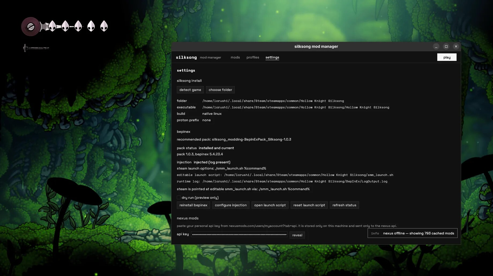
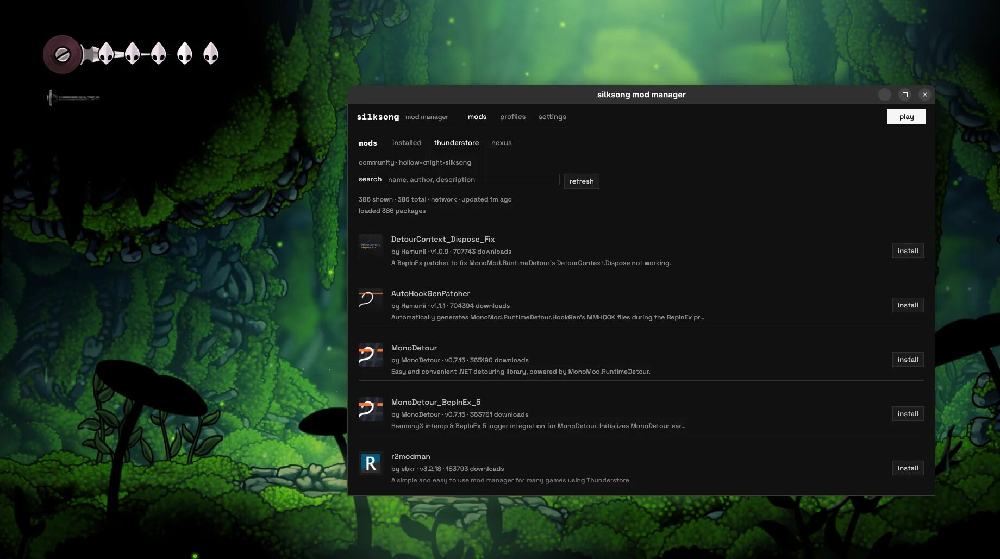
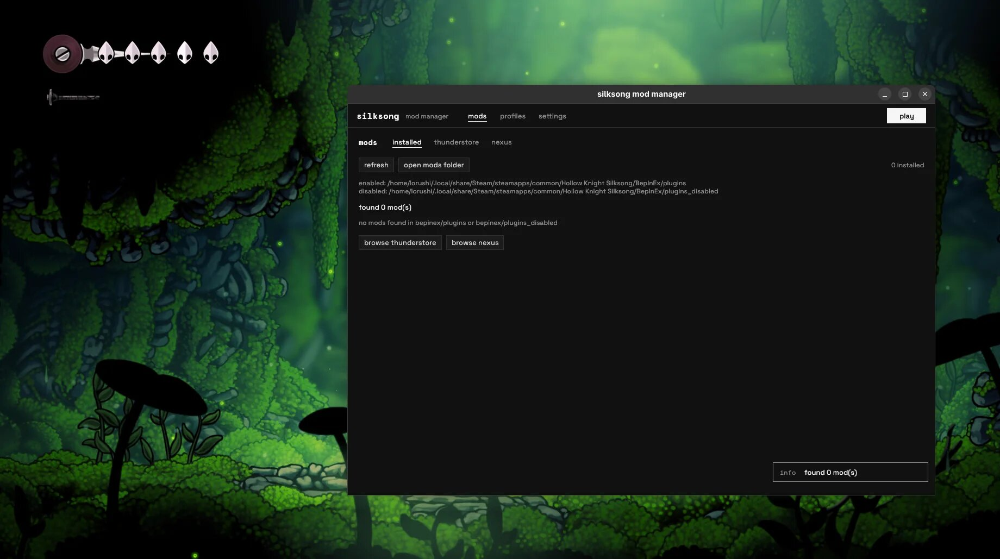

## a simple linux mod manager for hollow knight silksong.
browse and install mods from thunderstore and nexus, manage profiles, and launch the game with bepinex. linux only.

#### first time setup:
1. go to the root directory of the repo, run 'cargo run'
2. detect your game install first (native / flatpak / snap steam paths, or pick the folder)
3. install bepinex when asked (no need if already installed)
4. after that you can use mods, profiles, and play

#### macos installation notes
after installing if you get an error saying `pollip Is Damaged and Can’t Be Opened. You Should Move It To The Trash`
this should fix it
```
xattr -cr /Applications/pollip.app
```



#### thunderstore:
- open the mods tab and browse thunderstore packs
- click install on what you want
- no account or key needed




#### installed:
- check the installed tab for mods already in your bepinex plugins folders
- enable / disable / open the mods folder from there



#### nexus:
1. go to settings, site preferences and scroll all the way down
2. get your personal api key from nexusmods.com/users/myaccount?tab=api
3. paste it in the api key box
4. click save & validate
5. the key stays on your machine and is only sent to the nexus api

#### nexus downloads:
- premium: you can install mods straight from the app
- free: click “mod manager download” on the nexus website
- for free downloads, click “register nxm handler” in settings first so nxm:// links open this app

#### profiles:
- use the profiles tab to save sets of mods
- switch profiles when you want a different set


#### play:
- hit play in the top bar to launch silksong through steam with bepinex

#### notes
- tested only on fedora kde & gnome with native steam; other distros should work the same.
- flatpak and snap steam paths are searched for detection / launch options, but those installs are not fully tested yet.

creds: l0rush1, [grapefizz](https://github.com/grapefizz) (macos support + name)
